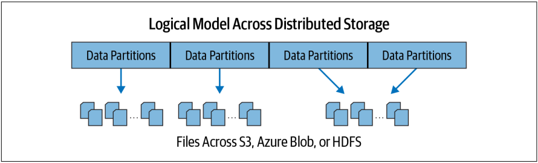
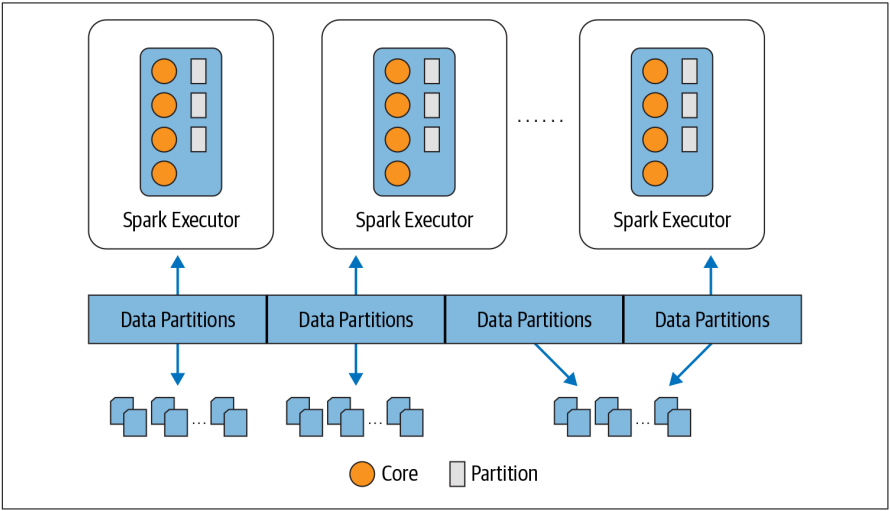

<div style="text-align: justify;">

# Introduction to Apache Spark: A Unified Analytics Engine

## The Genesis of Spark
### Big Data and Distributed Computing at Google

### Hadoop at Yahoo!

### Spark’s Early Years at AMPLab

## What Is Apache Spark
Apache Spark is a unified engine designed for large-scale distributed data processing, on premises in data centers or in the cloud
Spark’s design philosophy centers around four key characteristics: Speed, Ease of use, Modularity, Extensibility

### Speed
- the hardware industry’s recent huge strides in improving the price and performance of CPUs and memory
- query computations as a directed acyclic graph (DAG)
- its physical execution engine, Tungsten, uses whole-stage code generation to generate compact code for execution

### Ease of Use
Spark achieves simplicity by providing a fundamental abstraction of a simple logical data structure called a **Resilient Distributed Dataset (RDD)** upon which all other higher-level structured data abstractions, such as DataFrames and Datasets, are con‐structed.

### Modularity
Spark offers unified libraries with well-documented APIs that include the following modules as **core components: Spark SQL, Spark Structured Streaming, Spark MLlib, and GraphX**, combining all the workloads running under one engine.
Spark operations can be applied across many types of workloads and expressed in any
of **the supported programming languages: Scala, Java, Python, SQL, and R**.

### Extensibility
Spark focuses on its fast, parallel computation engine rather than on storage. Unlike Apache Hadoop, which included both storage and compute, Spark decouples the two.
Spark can read data stored in myriad sources: Apache Hadoop, Apache Cassandra, Apache HBase, MongoDB Apache Hive, RDBMSs, and more — and process it all in memory.
Spark’s DataFrameReaders and DataFrame Writers can also be extended to read data from other sources, such as Apache Kafka, Kinesis, Azure Storage, and Amazon S3, into its logical data abstraction

## Unified Analytics

### Apache Spark Components as a Unified Stack
Spark offers four distinct components as libraries for diverse workloads: **Spark SQL, Spark MLlib, Spark Structured Streaming, and GraphX**.
Each of these components is separate from Spark’s core fault-tolerant engine, in that *you use APIs to write your Spark application* and *Spark converts this into a DAG that is executed by the core engine*. So *whether you write your Spark code using the provided Structured APIs in Java, R, Scala, SQL, or Python, the underlying code is decomposed into highly compact bytecode that is executed in the workers’ JVMs across the cluster*.

#### Spark SQL
This module works well with *structured data*. You can *read data stored in an RDBMS table or from file formats with structured data (CSV, text, JSON, Avro, ORC, Parquet, etc.)* and *then construct permanent or temporary tables in Spark*. Also, when using Spark’s Structured APIs in Java, Python, Scala, or R, you can combine SQL-like queries to query the data just read into a Spark DataFrame. To date, Spark SQL is ANSI SQL:2003-compliant and it also functions as a pure SQL engine.
    
```scala
// Read data off Amazon S3 bucket into a Spark DataFrame
spark.read.json("s3://apache_spark/data/committers.json").createOrReplaceTempView("committers")
// Issue a SQL query and return the result as a Spark DataFrame
results = spark.sql("""SELECT name, org, module, release, num_commits FROM committers WHERE module = 'mllib' AND num_commits > 10 ORDER BY num_commits DESC""")
```

#### Spark MLlib
Spark comes with a library containing common machine learning (ML) algorithms called MLlib.
MLlib provides many popular machine learning algorithms built atop high-level DataFrame-based APIs to build models. These APIs allow you to extract or transform features, build pipelines (for training and evaluating), and persist models (for saving and reloading them) during deployment. Additional utilities include the use of common linear algebra operations and statistics.

```python
# In Python
from pyspark.ml.classification import LogisticRegression
...
training = spark.read.csv("s3://...")
test = spark.read.csv("s3://...")
# Load training data
lr = LogisticRegression(maxIter=10, regParam=0.3, elasticNetParam=0.8)
# Fit the model
lrModel = lr.fit(training)
# Predict
lrModel.transform(test)
...
```

#### Spark Structured Streaming
Apache Spark 2.0 introduced an experimental Continuous Streaming model and Structured Streaming APIs, built atop the Spark SQL engine and DataFrame-based APIs. By Spark 2.2, Structured Streaming was generally available, meaning that developers could use it in their production environments.
Necessary for big data developers to combine and react in real time to both static data and streaming data from engines like Apache Kafka and other streaming sources, the new model views a stream as a continually growing table, with new rows of data appended at the end. Developers can merely treat this as a structured table and issue queries against it as they would a static table.

```python
# In Python
# Read a stream from a local host
from pyspark.sql.functions import explode, split
lines = (
    spark.readStream
    .format("socket")
    .option("host", "localhost")
    .option("port", 9999)
    .load()
)
# Perform transformation
# Split the lines into words
words = lines.select(explode(split(lines.value, " ")).alias("word"))
# Generate running word count
word_counts = words.groupBy("word").count()
# Write out to the stream to Kafka
query = (
    word_counts.writeStream
    .format("kafka")
    .option("topic", "output")
)
```

#### GraphX
As the name suggests, GraphX is a library for manipulating graphs (e.g., social network graphs, routes and connection points, or network topology graphs) and performing graph-parallel computations. It offers the standard graph algorithms for analysis, connections, and traversals, contributed by users in the community: the available algorithms include PageRank, Connected Components, and Triangle Counting.

```scala
// In Scala
val graph = Graph(vertices, edges)
messages = spark.textFile("hdfs://...")
val graph2 = graph.joinVertices(messages) {
(id, vertex, msg) => ...
}
```

### Apache Spark’s Distributed Execution
Spark is a distributed data processing engine with its components working collaboratively on a cluster of machines. You need to understand how all the components of Spark’s distributed architecture work together and communicate, and what deployment modes are available.
At a high level in the Spark architecture, a Spark application consists of a driver program that is responsible for orchestrating parallel operations on the Spark cluster. The driver accesses the distributed components in the cluster—the Spark executors and cluster manager—through a SparkSession.


#### Spark driver
As the part of the Spark application responsible for instantiating a SparkSession, the Spark driver has multiple roles:
- it communicates with the cluster manager: it requests resources (CPU, memory, etc.) from the cluster manager for Spark’s executors (JVMs)
- it transforms all the Spark operations into DAG computations, schedules them, and distributes their execution as tasks across the Spark executors
#### SparkSession
SparkSession became a unified conduit to all Spark operations and data. 
Through this one conduit, you can create JVM runtime parameters, define DataFrames and Datasets, read from data sources, access catalog metadata, and issue Spark SQL queries. SparkSession provides a single unified entry point to all of Spark’s functionality.
In a standalone Spark application, you can create a SparkSession using one of the high-level APIs in the programming language of your choice. In the Spark shell (more on this in the next chapter) the SparkSession is created for you, and you can access it via a global variable called spark or sc.

```scala
// In Scala
import org.apache.spark.sql.SparkSession
// Build SparkSession
val spark = SparkSession
.builder
.appName("LearnSpark")
.config("spark.sql.shuffle.partitions", 6)
.getOrCreate()
...
// Use the session to read JSON
val people = spark.read.json("...")
...
// Use the session to issue a SQL query
val resultsDF = spark.sql("SELECT city, pop, state, zip FROM table_name")
```
#### Cluster manager
The cluster manager is responsible for managing and allocating resources for the cluster of nodes on which your Spark application runs. Currently, Spark supports four cluster managers: the built-in standalone cluster manager, Apache Hadoop YARN, Apache Mesos, and Kubernetes.
#### Spark executor
A Spark executor runs on each worker node in the cluster. The executors communicate with the driver program and are responsible for executing tasks on the workers. In most deployments modes, only a single executor runs per node.
#### Deployment modes
An attractive feature of Spark is its support for myriad deployment modes, enabling Spark to run in different configurations and environments. Because the cluster manager is agnostic to where it runs (as long as it can manage Spark’s executors and fulfill resource requests), Spark can be deployed in some of the most popular environments—such as Apache Hadoop YARN and Kubernetes—and can operate in different modes.

| Mode | Spark driver | Spark executor | Cluster manager |
| :--- | :--- | :--- | :--- |
| Local | Runs on a single JVM, like a laptop or single node | Runs on the same JVM as the driver | Runs on the same host |
| Standalone | Can run on any node in the cluster | Each node in the cluster will launch its own executor JVM | Can be allocated arbitrarily to any host in the cluster |
| YARN (client) | Runs on a client, not part of the cluster | YARN’s NodeManager’s container | YARN’s Resource Manager works with YARN’s Application Master to allocate the containers on NodeManagers for executors |
| YARN (cluster) | Runs with the YARN Application Master | Same as YARN client mode | Same as YARN client mode |
| Kubernetes | Runs in a Kubernetes pod | Each worker runs within its own pod | Kubernetes Master |

#### Distributed data and partitions
Actual physical data is distributed across storage as partitions residing in either HDFS or cloud storage. While the data is distributed as partitions across the physical cluster, Spark treats each partition as a high-level logical data abstraction—as a DataFrame in memory. Though this is not always possible, each Spark executor is preferably allocated a task that requires it to read the partition closest to it in the network, observing data locality.



Partitioning allows for efficient parallelism. A distributed scheme of breaking up data into chunks or partitions allows Spark executors to process only data that is close to them, minimizing network bandwidth. That is, each executor’s core is assigned its own data partition to work on.



For example, this code snippet will break up the physical data stored across clusters into eight partitions, and each executor will get one or more partitions to read into its memory:
```python
# In Python
log_df = spark.read.text("path_to_large_text_file").repartition(8)
print(log_df.rdd.getNumPartitions())
```
And this code will create a DataFrame of 10,000 integers distributed over eight partitions in memory:
```python
# In Python
df = spark.range(0, 10000, 1, 8)
print(df.rdd.getNumPartitions())
```

## The Developer’s Experience
Of all the developers’ delights, none is more attractive than a set of composable APIs that increase productivity and are easy to use, intuitive, and expressive. One of Apache Spark’s principal appeals to developers has been its easy-to-use APIs for operating on small to large data sets, across languages: Scala, Java, Python, SQL, and R.

### Who Uses Spark, and for What?
#### Data science tasks
Most data scientists must also know how to wrangle or transform data, and how to use established classification, regression, or clustering algorithms for building models. Often their tasks are iterative, interactive or ad hoc, or experimental to assert their hypotheses.
Spark supports these different tools. Spark’s MLlib offers a common set of machine learning algorithms to build model pipelines, using high-level estimators, transformers, and data featurizers. Spark SQL and the Spark shell facilitate interactive and ad hoc exploration of data.
Additionally, Spark enables data scientists to tackle large data sets and scale their model training and evaluation. Apache Spark 2.4 introduced a new gang scheduler, as part of Project Hydrogen, to accommodate the fault-tolerant needs of training and scheduling deep learning models in a distributed manner, and Spark 3.0 has introduced the ability to support GPU resource collection in the standalone, YARN, and Kubernetes deployment modes. This means developers whose tasks demand deep learning techniques can use Spark.
#### Data engineering tasks
Data engineers have a strong understanding of software engineering principles and methodologies, and possess skills for building scalable data pipelines for a stated business use case. Data pipelines enable end-to-end transformations of raw data coming from myriad sources—data is cleansed so that it can be consumed downstream by developers, stored in the cloud or in NoSQL or RDBMSs for report generation, or
made accessible to data analysts via business intelligence tools.
Spark 2.x introduced an evolutionary streaming model called continuous applications with Structured Streaming. With Structured Streaming APIs, data engineers can build complex data pipelines that enable them to ETL data from both real-time and static data sources.
Data engineers use Spark because it provides a simple way to parallelize computations and hides all the complexity of distribution and fault tolerance. This leaves them free to focus on using high-level DataFrame-based APIs and domain-specific language (DSL) queries to do ETL, reading and combining data from multiple sources.
The performance improvements in Spark 2.x and Spark 3.0, due to the Catalyst optimizer for SQL and Tungsten for compact code generation, have made life for data engineers much easier. They can choose to use any of the three Spark APIs—RDDs, DataFrames, or Datasets — that suit the task at hand, and reap the benefits of Spark.
#### Popular Spark use cases
Whether you are a data engineer, data scientist, or machine learning engineer, you’ll find Spark useful for the following use cases:
• Processing in parallel large data sets distributed across a cluster
• Performing ad hoc or interactive queries to explore and visualize data sets
• Building, training and evaluating machine learning models using MLlib
• Implementing end-to-end data pipelines from myriad streams of data
• Analyzing graph data sets and social networks

### Community Adoption and Expansion
Not surprisingly, Apache Spark struck a chord in the open source community, especially among data engineers and data scientists. Its design philosophy and its inclusion as an Apache Software Foundation project have fostered immense interest among the developer community.
Today, there are over 600 [Apache Spark Meetup groups](https://www.meetup.com/topics/apache-spark/) globally with close to half a million members. Every week, someone in the world is giving a talk at a meetup or conference or sharing a blog post on how to use Spark to build data pipelines. The [Spark + AI Summit](https://www.databricks.com/dataaisummit) is the largest conference dedicated to the use of Spark for machine learning, data engineering, and data science across many verticals.
Over the course of its releases, Spark has continued to attract contributors from across the globe and from numerous organizations. Today, Spark has close to 1,500 contributors, well over 100 releases, 21,000 forks, and some 27,000 commits on GitHub.

</div>